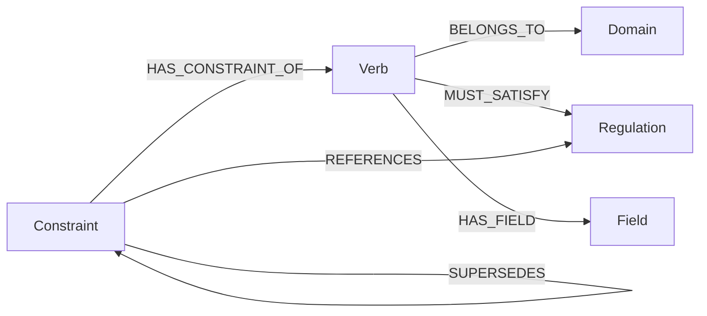

# Graph Model Contract  ·  v1.0

The auditor projects every validated ontology into Neo4j using the fixed
schema documented here. Every shipped certification criterion is a Cypher
query against this schema; any new CC MUST be expressible in terms of these
node labels, relationship types and properties. **Loader and queries are
coupled by this document** — change one without updating the other and the
audit silently produces wrong verdicts.

The schema is emitted by [`harness_auditor.loader.load`](../src/harness_auditor/loader.py)
and asserted by an in-line sanity check at the end of every load
(`LoaderMismatchError` on mismatch — exit code 3).

## Versioning

This contract tracks the major version of the `harness_auditor` package.

| Change kind | Example | Bump |
|---|---|---|
| Add an optional property | `Regulation.celex` | minor |
| Add a relationship type used only by a new CC | `(:Constraint)-[:NARROWS]->(:Constraint)` | minor |
| Add a CC that reads an already-defined edge | CC-11 reading `SUPERSEDES` | none |
| Rename / remove a label, type, or required property | `Verb` → `Action` | **major** |
| Change orientation of an existing edge | reversing `BELONGS_TO` | **major** |

---

## Nodes

| Label | Identity | Other properties | Schema constraint |
|---|---|---|---|
| `Domain` | `name` | `version`, `description?` | `name` unique |
| `Regulation` | `code` | `name`, `description?`, `celex?`, `informational` | `code` unique |
| `Verb` | `name` | `description?`, `risk_level`, `min_amm_level`, `requires_human_approval` | `name` unique |
| `Field` | _(none — scoped via `HAS_FIELD`)_ | `name`, `type`, `description?`, `required` | _none_ |
| `Constraint` | `name` | `type`, `decision_if_violated`, `regulation`, `reason`, `severity`, `precedence_level`, `parameter?`, `operator?`, `value?`, `condition_field?`, `condition_value?` | `name` unique |

`Field` is intentionally **not** globally unique. Two verbs may declare a
field with the same name and different types or descriptions. Reachability
is established through the verb-scoped `HAS_FIELD` edge, never through
label lookups — CC-02 depends on this.

---

## Relationships

| Type | Origin | Target | Cardinality | YAML source | Read by |
|---|---|---|---|---|---|
| `BELONGS_TO` | `Verb` | `Domain` | exactly 1 per verb | ontology root | CC-01, CC-10 |
| `MUST_SATISFY` | `Verb` | `Regulation` | 0..N per verb | `verb.must_satisfy[]` | CC-01, CC-06 |
| `HAS_FIELD` | `Verb` | `Field` | 0..N per verb | `verb.payload_schema[]` | CC-02 |
| `HAS_CONSTRAINT_OF` | `Constraint` | `Verb` | exactly 1 per constraint | `constraint.verb` | CC-02, CC-05, CC-06, CC-09 |
| `REFERENCES` | `Constraint` | `Regulation` | exactly 1 per constraint | `constraint.regulation` | CC-03, CC-06 |
| `SUPERSEDES` | `Constraint` | `Constraint` | 0..1 per constraint | `constraint.supersedes` | CC-04, CC-11 |

All edges are directed; orientation matters and is enforced by the
queries. Reversing an edge breaks the corresponding CC silently.

---

## Auxiliary subgraphs

Two CCs need data that does not belong to the current ontology. They live
in disjoint subgraphs, projected only when the CLI is invoked with the
corresponding optional flag.

### Previous-version subgraph  (CC-07, `--previous`)

When `--previous PATH` is given, the loader projects the previous-version
ontology through `load_previous`, which mirrors `load` with the `Prev`
suffix on every node label:

| Current | Previous |
|---|---|
| `Domain` | `DomainPrev` |
| `Regulation` | `RegulationPrev` |
| `Verb` | `VerbPrev` |
| `Field` | `FieldPrev` |
| `Constraint` | `ConstraintPrev` |

Relationship types are **not** suffixed — `BELONGS_TO`, `MUST_SATISFY`,
`HAS_FIELD`, `HAS_CONSTRAINT_OF`, `REFERENCES`, `SUPERSEDES` are reused.
Cypher's label-aware matching keeps the two subgraphs disjoint: a query
that matches `(:Verb)-[:BELONGS_TO]->(:Domain)` cannot accidentally cross
into the `Prev` half because the source label is `Verb`, not `VerbPrev`.

CC-07 fires only when at least one `:ConstraintPrev` node exists; the
runner's `skip_if` hook checks for that node and returns SKIP otherwise.

### Taxonomy subgraph  (CC-10, `--taxonomy`)

When `--taxonomy PATH` is given, the loader projects the registered verb
taxonomy through `load_taxonomy` as standalone nodes:

| Label | Properties | Schema constraint |
|---|---|---|
| `TaxonomyEntry` | `domain`, `verb_name` | _none — MERGE keyed on (domain, verb_name) for idempotency_ |

`TaxonomyEntry` is not connected to anything; CC-10 joins it to `Verb` by
property equality (`{domain: d.name, verb_name: v.name}`) at query time.
The runner's `skip_if` hook checks for the presence of any
`:TaxonomyEntry` node and returns SKIP when absent.

### GDS projection (CC-11)

CC-11 maintains a named GDS in-memory projection called `cc11_supersedes`
that includes only the `Constraint` label and the `SUPERSEDES` relationship
in `NATURAL` orientation. The projection is dropped (if it exists) at the
start of every CC-11 invocation, recreated, and consumed by
`gds.pageRank.stream`. No post-cleanup statement runs because the runner
captures evidence rows from the last statement only — see the comment in
`queries/cc11_constraint_centrality.cypher` for the rationale.

The projection's lifetime is bounded by the next CC-11 invocation or by
`make down` (which discards the entire sandbox along with all GDS state).

---

## Schema statements emitted by the loader

Run idempotently (`IF NOT EXISTS`) at the start of every load:

```cypher
CREATE CONSTRAINT domain_name      IF NOT EXISTS FOR (d:Domain)      REQUIRE d.name IS UNIQUE;
CREATE CONSTRAINT regulation_code  IF NOT EXISTS FOR (r:Regulation)  REQUIRE r.code IS UNIQUE;
CREATE CONSTRAINT verb_name        IF NOT EXISTS FOR (v:Verb)        REQUIRE v.name IS UNIQUE;
CREATE CONSTRAINT constraint_name  IF NOT EXISTS FOR (c:Constraint)  REQUIRE c.name IS UNIQUE;
```

These constraints carry **semantics**, not just hygiene: an ontology with
two verbs named `transfer_funds` is rejected at load time. The auditor never
tries to disambiguate; it refuses to certify the input.

`TaxonomyEntry` uses `MERGE` on `(domain, verb_name)` in lieu of a formal
uniqueness constraint — Neo4j Community 5.x does not support composite
node key constraints, and a `MERGE` on the load query achieves the same
idempotency.

---

## Cardinality invariants (loader sanity check)

After loading, before any criterion fires, the loader asserts that observed
counts equal expected counts. Any mismatch raises `LoaderMismatchError`.

| Label / type | Expected count expression |
|---|---|
| `Domain` | `1` |
| `Regulation` | `len(ontology.regulations)` |
| `Verb` | `len(ontology.verbs)` |
| `Field` | `sum(len(v.payload_schema) for v in ontology.verbs)` |
| `Constraint` | `len(ontology.constraints)` |
| `BELONGS_TO` | `len(ontology.verbs)` |
| `MUST_SATISFY` | `sum(len(v.must_satisfy) for v in ontology.verbs)` |
| `HAS_FIELD` | same as `Field` |
| `HAS_CONSTRAINT_OF` | `len(ontology.constraints)` |
| `REFERENCES` | `len(ontology.constraints)` |
| `SUPERSEDES` | `sum(1 for c in ontology.constraints if c.supersedes)` |

What this catches:

- a `must_satisfy` code referring to a regulation absent from the ontology
- a constraint attached to an undeclared verb
- a `supersedes` value pointing at a deleted constraint
- a `regulation` value pointing at an undeclared regulation

All would silently produce zero relationships rather than failing the load,
absent the sanity check.

---

## Visual reference



Plain-text equivalent, for terminals and reviewers without a Mermaid renderer:

```
    Verb        --BELONGS_TO-->         Domain
    Verb        --MUST_SATISFY-->       Regulation
    Verb        --HAS_FIELD-->          Field
    Constraint  --HAS_CONSTRAINT_OF-->  Verb
    Constraint  --REFERENCES-->         Regulation
    Constraint  --SUPERSEDES-->         Constraint
```

---

## CC ↔ relationship index

| CC | Relationships read | Failure semantic |
|---|---|---|
| **CC-01** Verb groundedness | `BELONGS_TO`, `MUST_SATISFY` | a `Verb` with zero outgoing `MUST_SATISFY` |
| **CC-02** Constraint reachability | `HAS_CONSTRAINT_OF`, `HAS_FIELD` | a non-`required_field` `Constraint` whose `parameter` matches no `HAS_FIELD` target on its verb |
| **CC-03** Orphan regulations | `REFERENCES` | a non-informational `Regulation` with zero incoming `REFERENCES` |
| **CC-04** SUPERSEDES cycles | `SUPERSEDES` | a `Constraint` reachable from itself via `SUPERSEDES*1..` |
| **CC-05** Precedence collision | `HAS_CONSTRAINT_OF` + property `precedence_level` | two constraints attached to the same verb with the same `precedence_level` |
| **CC-06** Coverage map | `MUST_SATISFY`, `HAS_CONSTRAINT_OF`, `REFERENCES` | a verb whose declared regulations are not all anchored by at least one of its constraints |
| **CC-07** Drift delta | previous-version subgraph (`ConstraintPrev`, `VerbPrev`) | a `:ConstraintPrev.name` with no matching `:Constraint.name` |
| **CC-08** Authority gradient | property `risk_level` + `min_amm_level` on `Verb` | a verb whose `min_amm_level` is below the canonical floor for its `risk_level` |
| **CC-09** Fail-closed defaults | property `decision_if_violated` on `Constraint` | any constraint with `decision_if_violated = 'ALLOW'` (post-schema drift) |
| **CC-10** Hallucinated verbs | `BELONGS_TO` + taxonomy subgraph (`TaxonomyEntry`) | a `:Verb` with no matching `:TaxonomyEntry {domain, verb_name}` |
| **CC-11** Constraint centrality | `SUPERSEDES` (via GDS PageRank projection) | a `:Constraint` whose PageRank exceeds `threshold_ratio × mean_score` |

A new CC that needs a relationship not listed in the **Relationships** table
above is a model change and must be added here (minor version bump) before
the loader is taught to emit it.
